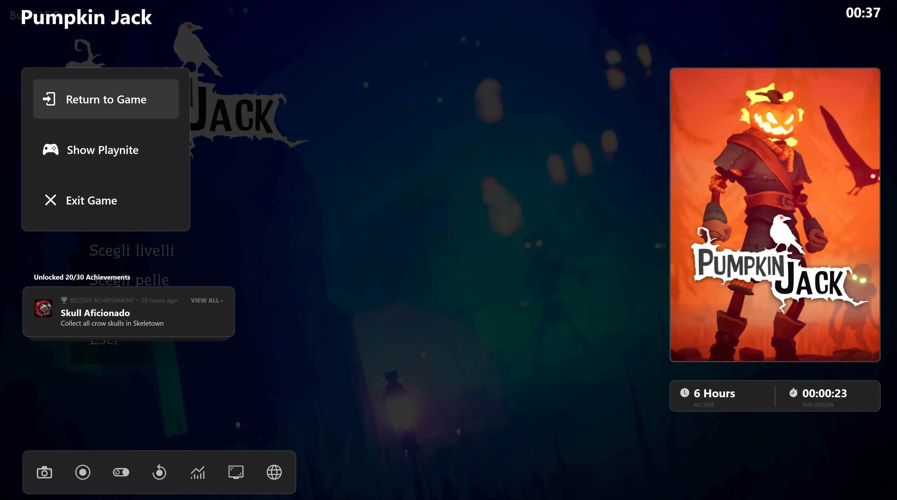
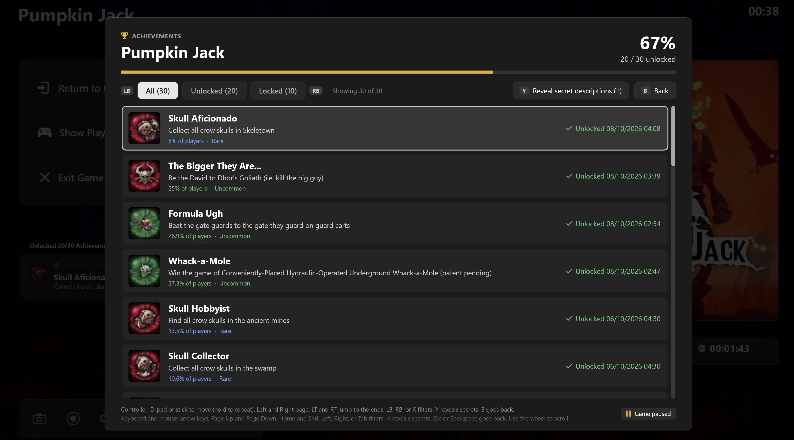
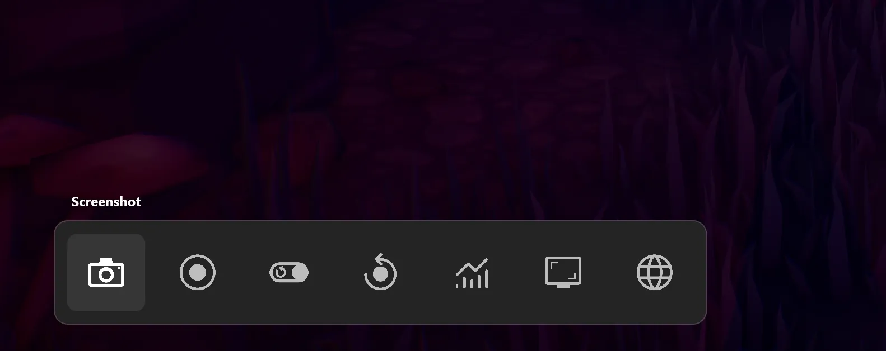
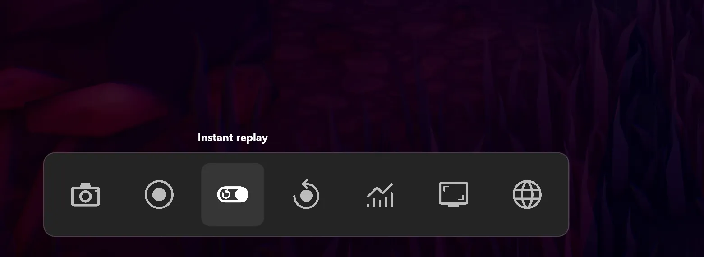
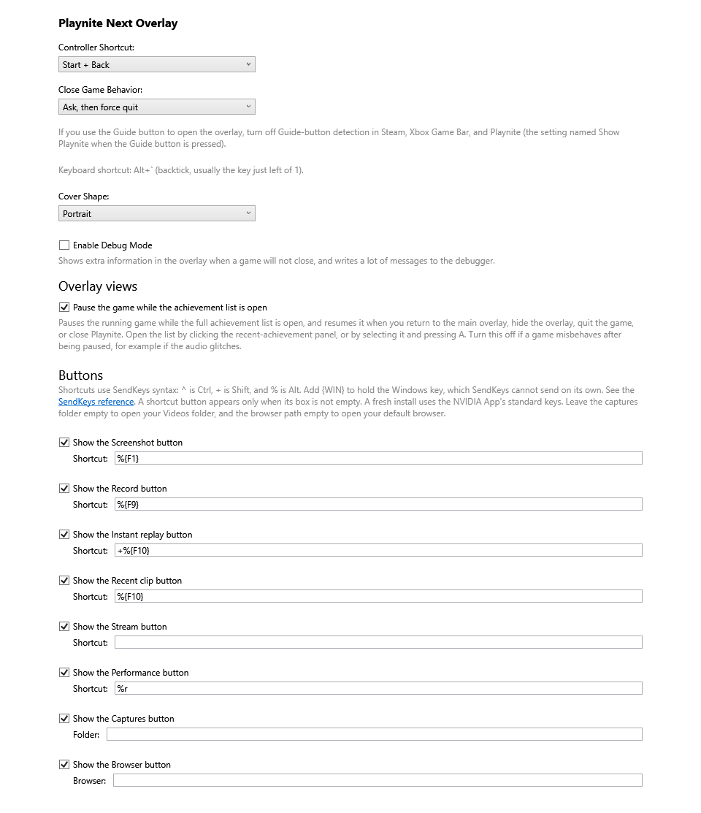

# Playnite Next Overlay

**Your achievements, inside the game.** An in-game overlay for [Playnite](https://playnite.link/) that brings the full [Playnite Achievements](https://github.com/justin-delano/PlayniteAchievements) list on screen, so you can browse it with a gamepad or a mouse without ever leaving the game.


Playnite Next Overlay continues [Playnite Game Overlay](https://github.com/jonosellier/PlayniteGameOverlay) by jonosellier, which has not been updated since July 2025.

> **Coming from Playnite Game Overlay?** Disable or uninstall it before you install this one (Playnite, Add-ons, Extensions). Both overlays listen for the same shortcuts, and running them side by side causes conflicts. Everything the old overlay did is here, and more.



## Your achievements, now interactive

Until now, an overlay could show you the last achievement you unlocked and a counter. Playnite Next Overlay turns that panel into a door: click it, or press A on it, and the complete achievement list for the game you are playing opens right over it.



- **Every achievement**, with its icon, description, progress and how rare it is.
- **Filters** for all, unlocked and locked achievements, one button press away.
- **No spoilers.** Secret descriptions stay hidden until you unlock them, or until you choose to reveal them.
- **Made for handhelds.** Scroll with the gamepad, the mouse or the touchpad. It works just as well on a desktop.
- **The game waits for you.** The game is paused while the list is open and resumes the moment you go back. You can turn this off.
- **Your language.** Names and descriptions come from Playnite Achievements, in the language you set there.

## Capture buttons



Screenshot, record, save a recent clip, instant replay and a performance overlay are each one button away. Each button sends a keyboard shortcut to the recorder you already use, so nothing new runs in the background.

I use it with the **NVIDIA App**, and these are the NVIDIA App's standard shortcuts in the format the settings expect:

| Button | NVIDIA App keys | Value in settings |
| --- | --- | --- |
| Screenshot | Alt+F1 | `%{F1}` |
| Record | Alt+F9 | `%{F9}` |
| Recent clip (save Instant Replay) | Alt+F10 | `%{F10}` |
| Instant replay on or off | Alt+Shift+F10 | `+%{F10}` |
| Performance overlay | Alt+R | `%r` |

A fresh install already comes set up with these keys, so if you use the NVIDIA App you don't need to change anything. With another recorder, just replace them in settings.

Steam and any other recorder with keyboard shortcuts work too. The [full guide](docs/USAGE.md) explains the shortcut format.



Next to the capture buttons you also get a button that opens your captures folder, one that opens your browser, and the game's cover, total playtime, session time and battery level.

## Installation

1. Download `PlayniteNextOverlay_1.0.0.pext` from the [Releases](https://github.com/aleksejsgx/PlayniteNextOverlay/releases) page.
2. Double-click it. Playnite opens and installs it for you.
3. Restart Playnite when it asks.

For the achievement features, install [Playnite Achievements](https://github.com/justin-delano/PlayniteAchievements) as well. Requires Playnite 10.

## Getting started

- Press **Alt+`** (the key left of 1), or **Start + Back** on a controller, to show or hide the overlay.
- Move with the D-pad, the left stick or the arrow keys. Press A or Enter to choose, and B or Esc to close.
- Set your recorder's shortcuts in Playnite, under Add-ons, then Extensions settings, then Playnite Next Overlay.



The [full guide](docs/USAGE.md) covers every control, the shortcut format and how the game pause works.

## Roadmap

1.0 is the first release, and more are on the way. Next up is a screenshot and video manager inside the overlay: browse your captures, preview them and delete them with the gamepad, without leaving the game.

Ideas and bug reports are welcome in [Issues](https://github.com/aleksejsgx/PlayniteNextOverlay/issues).

## Building

The project targets .NET Framework 4.6.2 and builds with the .NET SDK:

```powershell
dotnet build -c Release
powershell -File .\pack.ps1 -Destination .\PlayniteNextOverlay_1.0.0.pext
```

The repository address lives in `REPOSITORY.url`, and the add-on manifests point at the same place, so update them together.

## License

MIT. See [LICENSE.txt](LICENSE.txt).
